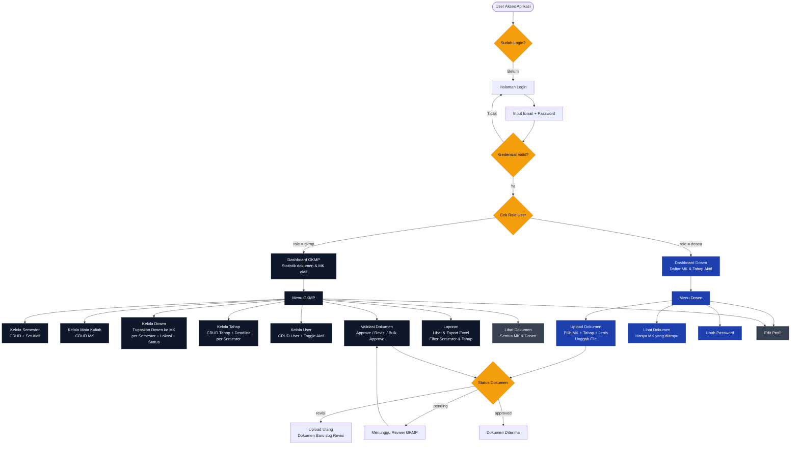
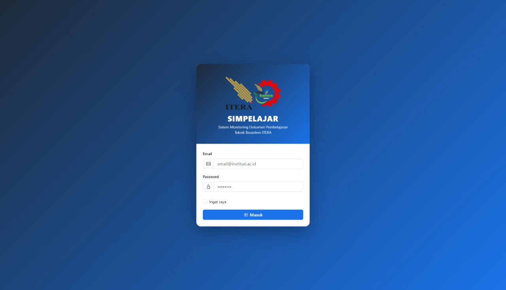
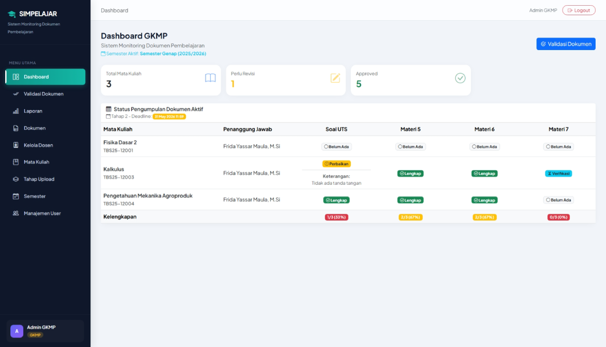
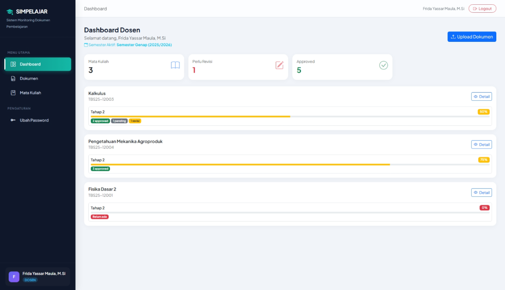
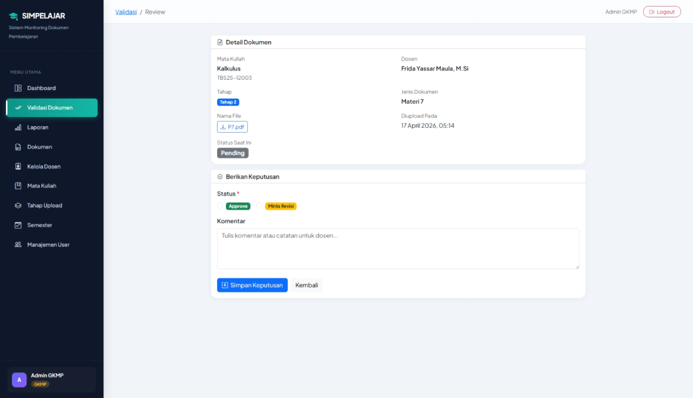
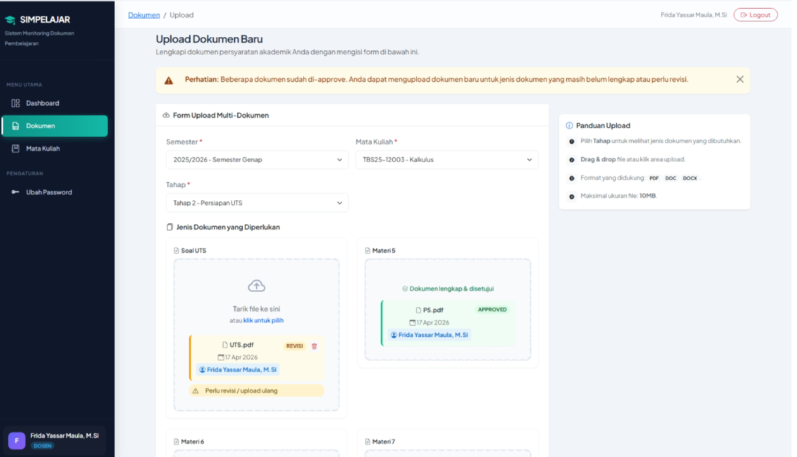
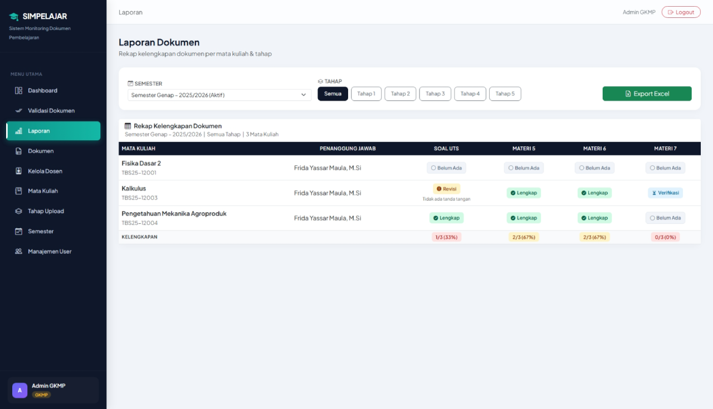

<div align="center">

# SimpeLajar

### Sistem Manajemen Dokumen Mutu Perkuliahan

*A structured academic document workflow platform for Indonesian higher education institutions*

[](https://php.net)
[](https://laravel.com)
[](https://mysql.com)
[](https://tailwindcss.com)
[](https://docker.com)
[](LICENSE)
[]()

</div>

---

## Table of Contents

- [About the Project](#about-the-project)
- [Built With](#built-with)
- [System Architecture](#system-architecture)
- [Database Schema](#database-schema)
- [Features](#features)
- [User Roles](#user-roles)
- [Screenshots](#screenshots)
- [Getting Started](#getting-started)
  - [Prerequisites](#prerequisites)
  - [Installation with Docker](#installation-with-docker)
  - [Local Installation (without Docker)](#local-installation-without-docker)
  - [Environment Configuration](#environment-configuration)
- [Usage](#usage)
  - [Default Accounts](#default-accounts)
  - [Typical Workflow](#typical-workflow)
  - [CLI Reference](#cli-reference)
- [Project Structure](#project-structure)
- [Roadmap](#roadmap)
- [License & Contact](#license--contact)

---

## About the Project

SimpeLajar adalah platform web fullstack untuk **manajemen siklus hidup dokumen mutu perkuliahan** di lingkungan perguruan tinggi. Aplikasi ini memodelkan proses pengumpulan, validasi, dan pelaporan dokumen akademik (RPS, Kontrak Kuliah, Soal UTS/UAS, Nilai, dsb.) yang diorganisir secara hierarkis berdasarkan mata kuliah, semester, dan tahap pengumpulan.

### Latar Belakang

Proses penjaminan mutu akademik di perguruan tinggi seringkali dikelola secara manual melalui email, spreadsheet, dan folder bersama yang tidak terstruktur. Kondisi ini menimbulkan beberapa masalah operasional:

| Masalah | Dampak |
|---|---|
| Tidak ada versioning dokumen | GKMP sulit melacak riwayat revisi |
| Status kelengkapan tidak real-time | Perlu rekap manual sebelum deadline |
| Tidak ada audit trail | Tidak diketahui siapa yang upload dan kapan |
| Distribusi informasi tidak terpusat | Dosen dan GKMP bekerja pada sumber data yang berbeda |

SimpeLajar menyelesaikan masalah di atas dengan menyediakan satu platform terpusat yang memiliki:

- **Structured document pipeline** — setiap dokumen melewati state machine `pending → revisi → approved` yang jelas.
- **Revision chain** — setiap revisi dokumen disimpan dengan `parent_id`, menghasilkan riwayat versi yang lengkap tanpa menghapus data lama.
- **Progress tracking** — progress kelengkapan dokumen per mata kuliah dan per tahap dikalkulasi secara otomatis.
- **Exportable reporting** — laporan kelengkapan dokumen dapat diekspor ke Excel dengan formatting yang siap pakai.

### Keputusan Arsitektur

| Keputusan | Alasan |
|---|---|
| Laravel 12 sebagai framework utama | Convention-over-configuration, Eloquent ORM, Blade templating, dan ekosistem paket yang matang mempercepat development. |
| MySQL sebagai database | Relasi antar entitas bersifat kompleks dan terstruktur; MySQL memberikan performa JOIN yang konsisten dan dukungan constraint FK penuh. |
| Maatwebsite/Excel untuk ekspor | Abstraksi yang matang di atas PhpSpreadsheet; mendukung styling, multi-sheet, dan stream export besar tanpa OOM. |
| Docker + Nginx untuk deployment | Mengeliminasi dependency hell; memudahkan reproduksi environment di mesin manapun. |

Terdapat dua peran utama:
- **Dosen** — mengunggah dokumen mata kuliah yang mereka ampu.
- **GKMP** (Gugus Kendali Mutu Prodi) — mengelola seluruh data master, mengvalidasi dokumen, dan mengekspor laporan.

---

## Built With

### Backend

| Teknologi | Versi | Peran |
|---|---|---|
| PHP | 8.2+ | Runtime bahasa utama |
| Laravel | 12.x | Web framework (MVC, routing, Eloquent ORM, Blade) |
| Laravel Breeze | 2.x | Auth scaffolding (login, registrasi, profil) |
| Maatwebsite/Laravel Excel | 3.1 | Ekspor laporan ke `.xlsx` |
| barryvdh/laravel-dompdf | 3.1 | Rendering PDF |
| Laravel Tinker | 2.x | REPL interaktif untuk debugging production-safe |
| Laravel Pail | 1.x | Real-time log streaming di terminal |
| Laravel Pint | 1.x | PHP code style fixer (PSR-12) |

### Frontend

| Teknologi | Versi | Peran |
|---|---|---|
| Blade | — | Server-side templating engine |
| Tailwind CSS | 3.x | Utility-first CSS framework |
| Alpine.js | 3.x | Lightweight reactive JS untuk interaktivitas UI |
| Vite | 7.x | Frontend build tool (HMR, bundling, asset optimization) |

### Infrastruktur

| Teknologi | Peran |
|---|---|
| MySQL 8 | Relational database engine |
| Nginx (Alpine) | Reverse proxy & static file server |
| Docker + Docker Compose | Kontainerisasi seluruh service (app + webserver) |

### Testing & Tooling

| Teknologi | Peran |
|---|---|
| PHPUnit 11 | Unit dan Feature testing |
| Faker | Data faker untuk seeder dan factory |
| Mockery | Mocking framework |

---

## System Architecture

### High-Level Request Flow

```
Browser / Client
    │
    ▼
Nginx (Port 8085)                      ← Reverse proxy, melayani static assets
    │
    ▼
PHP-FPM (Laravel 12)                   ← Application server
    │
    ├── bootstrap/app.php              ← Konfigurasi framework & register middleware
    ├── routes/web.php                 ← Dispatch HTTP request ke controller
    │       ├── middleware: auth        ← Verifikasi session Laravel
    │       └── middleware: role:gkmp  ← RoleMiddleware: abort 403 jika role tidak sesuai
    │
    ├── Controller@method
    │       └── Eloquent Model         ← ORM query ke MySQL
    │               └── MySQL 8        ← Penyimpanan data
    │
    └── Blade View                     ← Render HTML + Tailwind CSS + Alpine.js
            └── HTTP Response
```

### Document State Machine

Setiap dokumen yang diunggah melewati state machine berikut:

```
           Upload Dosen
               │
               ▼
           ┌───────┐
           │ PENDING│  ◄──────────────────┐
           └───┬───┘                      │
               │ GKMP Review              │ Upload Ulang (Dosen)
      ┌────────┴─────────┐                │
      │                  │                │
      ▼                  ▼                │
┌──────────┐        ┌────────┐            │
│ APPROVED │        │ REVISI │ ───────────┘
└──────────┘        └────────┘
   (is_current=true)    (komentar dikirim ke Dosen)
```

Ketika revisi diupload, sistem membuat record `Dokumen` baru dengan `parent_id` menunjuk ke dokumen lama. Dokumen lama dipertahankan di database (`is_current = false`) sebagai audit trail, sementara dokumen baru kembali ke status `pending`.

### Access Control Flow

```
HTTP Request
    │
    ▼
middleware('auth')         ← Cek session; redirect ke /login jika unauthenticated
    │
    ▼
middleware('role:gkmp')    ← Cek users.role; abort(403) jika tidak sesuai
    │                         (RoleMiddleware.php)
    ▼
Controller::__construct()  ← abort_unless(auth()->user()?->isGkmp(), 403)
    │                         (cek ganda, defence-in-depth)
    ▼
Controller@method()        ← Data query difilter berdasarkan dosen_id untuk role Dosen
```

---

## Database Schema

### Entity Relationship Diagram

```
┌─────────────┐           ┌───────────────────┐           ┌──────────────┐
│    users    │           │  dosen_mata_kuliah │           │  mata_kuliah │
│─────────────│           │───────────────────│           │──────────────│
│ id (PK)     │──────────<│ dosen_id (FK)      │>──────────│ id (PK)      │
│ name        │           │ mata_kuliah_id (FK)│           │ nama_mk      │
│ email       │           │ semester_id (FK)   │           │ kode_mk      │
│ password    │           │ lokasi             │           └──────┬───────┘
│ role (enum) │           │ status_dosen       │                  │
│ is_active   │           └───────────────────┘                  │
└──────┬──────┘       UNIQUE(dosen_id, mk_id, semester_id)        │
       │                                                           │
       │                                                    ┌──────▼───────┐
       │                                                    │   dokumen    │
       │ uploaded_by (FK)                                   │──────────────│
       └───────────────────────────────────────────────────>│ id (PK)      │
                                                            │ mk_id (FK)   │
┌──────────────┐      ┌─────────────────┐                  │ tahap_id (FK)│
│  semester    │      │      tahap      │                  │ jenis_dok    │
│──────────────│      │─────────────────│                  │ nama_file    │
│ id (PK)      │──────│ semester_id (FK)│──────────────────│ file_path    │
│ nama_semester│      │ kat_tahap_id(FK)│  tahap_id (FK)   │ uploaded_by  │
│ tahun_ajaran │      │ deadline        │                  │ status (enum)│
│ tipe (enum)  │      └────────┬────────┘                  │ komentar     │
│ is_active    │               │                           │ parent_id(FK)│
└──────────────┘               │                           │ is_current   │
                        ┌──────▼────────┐                  └──────┬───────┘
                        │ kategori_tahap│                         │ self-referential
                        │───────────────│                         ▼
                        │ id (PK)       │               dokumen (parent_id)
                        │ nama_tahap    │               [Revision Chain]
                        │ deskripsi     │
                        │ urutan        │
                        │ jenis_dokumen │ ← JSON array
                        └───────────────┘
```

### Tabel Utama

#### `users`
| Kolom | Tipe | Keterangan |
|---|---|---|
| `id` | `bigint` PK | Auto-increment |
| `name` | `string` | Nama lengkap user |
| `email` | `string` UNIQUE | Digunakan untuk login |
| `password` | `string` | Bcrypt hashed |
| `role` | `enum('dosen','gkmp')` | Menentukan akses |
| `is_active` | `boolean` | `true` = dapat login; `false` = diblokir |

#### `semester`
| Kolom | Tipe | Keterangan |
|---|---|---|
| `id` | `bigint` PK | |
| `nama_semester` | `string` | contoh: `"Ganjil 2025"` |
| `tahun_ajaran` | `string(9)` | Format: `YYYY/YYYY` |
| `tipe` | `enum('ganjil','genap')` | |
| `is_active` | `boolean` | Hanya satu boleh aktif pada satu waktu |

#### `mata_kuliah`
| Kolom | Tipe | Keterangan |
|---|---|---|
| `id` | `bigint` PK | |
| `nama_mk` | `string` | Nama mata kuliah |
| `kode_mk` | `string` UNIQUE | Kode MK (misal: `CS101`) |

#### `dosen_mata_kuliah` *(Pivot Table)*
| Kolom | Tipe | Keterangan |
|---|---|---|
| `id` | `bigint` PK | |
| `dosen_id` | FK → `users` | |
| `mata_kuliah_id` | FK → `mata_kuliah` | |
| `semester_id` | FK → `semester` | Nullable |
| `lokasi` | `string` | Ruang/kelas mengajar |
| `status_dosen` | `string` | `Penanggung Jawab` atau `Pemateri` |

> **Constraint:** `UNIQUE(dosen_id, mata_kuliah_id, semester_id)` — satu dosen hanya dapat ditugaskan ke satu MK per semester sekali.

#### `kategori_tahap`
| Kolom | Tipe | Keterangan |
|---|---|---|
| `id` | `bigint` PK | |
| `nama_tahap` | `string` | contoh: `"Tahap 1"` |
| `deskripsi` | `text` | |
| `urutan` | `tinyint` UNIQUE | Urutan tampil |
| `jenis_dokumen` | `JSON` | Array jenis dokumen yang wajib diunggah per tahap |

**Data bawaan (seeder):** Tahap 1–5 dengan jenis dokumen mencakup: RPS, Kontrak Kuliah, Materi 1–15, Soal UTS, Soal UAS, Nilai UTS, Nilai UAS, DNA, Portofolio, LJU, dsb.

#### `tahap`
| Kolom | Tipe | Keterangan |
|---|---|---|
| `id` | `bigint` PK | |
| `semester_id` | FK → `semester` | Instance tahap per semester |
| `kategori_tahap_id` | FK → `kategori_tahap` | Mapping ke master kategori |
| `deadline` | `datetime` | Batas waktu pengumpulan |

#### `dokumen`
| Kolom | Tipe | Keterangan |
|---|---|---|
| `id` | `bigint` PK | |
| `mata_kuliah_id` | FK → `mata_kuliah` | |
| `tahap_id` | FK → `tahap` | |
| `jenis_dokumen` | `string` | Salah satu nilai dari `kategori_tahap.jenis_dokumen` |
| `nama_file` | `string` | Nama file original saat upload |
| `file_path` | `string` | Path di `storage/` |
| `uploaded_by` | FK → `users` | |
| `status` | `enum('pending','revisi','approved')` | Default `pending` |
| `komentar` | `text` | Nullable; diisi GKMP saat status `revisi` |
| `parent_id` | FK → `dokumen` | Nullable; menunjuk versi sebelumnya (revision chain) |
| `is_current` | `boolean` | `true` = versi aktif; hanya satu per kategori (MK + Tahap + Jenis) |

---

## Features

### GKMP (Administrator Mutu)

| Fitur | Deskripsi |
|---|---|
| **Dashboard Statistik** | Agregat real-time: total MK aktif, total dokumen, jumlah pending / revisi / approved |
| **Manajemen Semester** | CRUD semester (Ganjil/Genap); hanya satu semester boleh aktif pada satu waktu |
| **Manajemen Mata Kuliah** | CRUD kode & nama MK; lihat detail per MK beserta progress dokumen |
| **Penugasan Dosen** | Tugaskan dosen ke MK per semester dengan atribut lokasi kelas dan status (`Penanggung Jawab` / `Pemateri`) |
| **Manajemen Tahap** | Buat tahap pengumpulan dokumen per semester; dipetakan ke `KategoriTahap` + set deadline |
| **Manajemen User** | CRUD semua user; toggle aktif/nonaktif; reset password |
| **Validasi Dokumen** | Approve dokumen, minta revisi dengan komentar, atau bulk approve semua dokumen pending |
| **Laporan & Ekspor** | Lihat laporan kelengkapan per semester/tahap; ekspor ke `.xlsx` dengan styling siap pakai |

### Dosen (Kontributor Dokumen)

| Fitur | Deskripsi |
|---|---|
| **Dashboard MK** | Daftar mata kuliah yang diampu di semester aktif beserta tahap yang sedang berjalan |
| **Upload Dokumen** | Unggah file per MK + tahap + jenis dokumen yang diwajibkan |
| **Revisi Dokumen** | Upload ulang file ketika dikembalikan oleh GKMP; riwayat revisi tersimpan via `parent_id` |
| **Monitor Status** | Lihat status dokumen (pending / revisi / approved) beserta komentar GKMP |
| **Ubah Password** | Halaman eksklusif `/ubah-password` untuk dosen |

### Umum (Kedua Peran)

| Fitur | Deskripsi |
|---|---|
| **Autentikasi** | Login/logout berbasis session (email + password) via Laravel Breeze |
| **Edit Profil** | Update nama, email, dan password |
| **RBAC** | Akses dikontrol `RoleMiddleware`; defence-in-depth via `abort_unless` di constructor |

---

## User Roles

Aplikasi memiliki **2 role** yang disimpan sebagai `enum('dosen', 'gkmp')` di kolom `users.role` dan divalidasi oleh `RoleMiddleware` pada setiap request.

### GKMP (`role = gkmp`) — Administrator Mutu

GKMP adalah **pengelola sistem** yang mengatur seluruh data master dan proses validasi dokumen. Semua route write-nya dilindungi `middleware('role:gkmp')` dan sebagian besar controller-nya memiliki cek ganda via `abort_unless(auth()->user()?->isGkmp(), 403)` di constructor.

### Dosen (`role = dosen`) — Pengampu Mata Kuliah

Dosen adalah **kontributor dokumen**. Data yang ditampilkan secara otomatis difilter berdasarkan `dosen_id` di tabel pivot `dosen_mata_kuliah`, sehingga dosen hanya dapat melihat dan mengelola data yang relevan dengan dirinya.

### Mekanisme Enforcement

```php
// RoleMiddleware.php — dieksekusi di setiap request pada route yang dilindungi
if (!in_array($request->user()->role, $roles)) {
    abort(403, 'Akses tidak diizinkan.');
}

// Cek ganda di constructor controller (contoh: SemesterController)
abort_unless(auth()->user()?->isGkmp(), 403);

// Helper method di User model
public function isDosen(): bool { return $this->role === 'dosen'; }
public function isGkmp(): bool  { return $this->role === 'gkmp'; }
```

### Access & Workflow Flowchart



---

## Screenshots

### Login Page


*Halaman login aplikasi SimpeLajar.*

### Dashboard GKMP



*Statistik agregat: total mata kuliah aktif, jumlah dokumen pending / revisi / approved.*

### Dashboard Dosen


*Daftar mata kuliah yang diampu beserta tahap yang sedang berjalan.*

### Halaman Validasi Dokumen


*GKMP mereview dokumen: approve, minta revisi, atau bulk approve.*

### Form Upload Dokumen


*Dosen memilih mata kuliah, tahap, jenis dokumen, dan mengunggah file.*

### Laporan Kelengkapan Dokumen


*Tabel kelengkapan dokumen per mata kuliah, dapat difilter per semester dan tahap.*

---

## Getting Started

### Prerequisites

Pastikan environment memenuhi persyaratan berikut sebelum memulai instalasi:

| Komponen | Versi Minimum | Keterangan |
|---|---|---|
| PHP | 8.2+ | Dengan ekstensi: `pdo_mysql`, `gd`, `mbstring`, `xml`, `zip`, `curl` |
| Composer | 2.x | PHP dependency manager |
| Node.js | 18+ | Diperlukan untuk build frontend (Vite) |
| npm | 9+ | Digunakan bersamaan dengan Node.js |
| MySQL | 8.x | Database engine utama |
| Docker & Docker Compose | Latest | *Opsional* — untuk deployment via container |
| Git | — | Untuk clone repositori |

> **Catatan:** Jika menggunakan Docker, Anda hanya memerlukan Docker + Docker Compose. PHP, Node.js, dan MySQL tidak perlu diinstall secara lokal karena sudah tersedia di dalam container.

---

### Environment Configuration

Salin file `.env.example` ke `.env`, lalu sesuaikan variabel berikut:

```bash
cp .env.example .env
```

**Variabel konfigurasi utama:**

| Variabel | Nilai Default | Keterangan |
|---|---|---|
| `APP_NAME` | `SimpeLajar` | Nama aplikasi (tampil di UI) |
| `APP_ENV` | `local` | Set ke `production` untuk deployment |
| `APP_DEBUG` | `true` | Set ke `false` di production |
| `APP_URL` | `http://localhost` | Base URL; gunakan `http://localhost:8085` untuk Docker |
| `DB_CONNECTION` | `mysql` | Driver database |
| `DB_HOST` | `127.0.0.1` | Host MySQL; gunakan nama service Docker jika containerized |
| `DB_PORT` | `3306` | Port MySQL |
| `DB_DATABASE` | `simpelajar` | Nama database |
| `DB_USERNAME` | `root` | Username MySQL |
| `DB_PASSWORD` | — | Password MySQL |
| `FILESYSTEM_DISK` | `local` | Disk penyimpanan file upload |
| `SESSION_DRIVER` | `database` | Driver session |
| `QUEUE_CONNECTION` | `sync` | Untuk async processing, ganti ke `database` |

---

### Installation with Docker

Cara tercepat untuk menjalankan SimpeLajar secara lokal atau di server.

```bash
# 1. Clone repositori
git clone <repo-url>
cd simpelajar

# 2. Konfigurasi environment
cp .env.example .env
# Edit .env: sesuaikan DB_HOST (gunakan nama service MySQL container Anda),
# DB_DATABASE, DB_USERNAME, DB_PASSWORD

# 3. Build dan jalankan container
docker-compose up -d --build

# 4. Masuk ke container aplikasi
docker exec -it simpelajar_app bash

# 5. Install dependensi PHP
composer install --optimize-autoloader --no-dev

# 6. Generate application key
php artisan key:generate

# 7. Buat symlink storage
php artisan storage:link

# 8. Jalankan migrasi & seeding
php artisan migrate --force
php artisan db:seed

# 9. Build aset frontend
npm install && npm run build

# 10. Keluar dari container
exit
```

Aplikasi dapat diakses di **`http://localhost:8085`**.

---

### Local Installation (without Docker)

```bash
# 1. Clone repositori
git clone <repo-url>
cd simpelajar

# 2. Install dependensi PHP
composer install

# 3. Install dependensi Node.js
npm install

# 4. Konfigurasi environment
cp .env.example .env
php artisan key:generate

# 5. Buat symlink storage
php artisan storage:link

# 6. Buat database MySQL terlebih dahulu, lalu konfigurasi .env
# DB_HOST=127.0.0.1, DB_DATABASE=simpelajar, dst.

# 7. Jalankan migrasi
php artisan migrate

# 8. Seed data awal
php artisan db:seed

# 9. Build aset frontend (production)
npm run build

# 10. Jalankan development server
php artisan serve
```

Aplikasi dapat diakses di **`http://localhost:8000`**.

**Shortcut via Composer scripts:**

```bash
# One-command setup (composer install → key:generate → migrate → npm install → npm run build)
composer setup

# Development mode dengan hot-reload (artisan serve + queue + pail logs + vite HMR)
composer dev
```

---

## Usage

### Default Accounts

Akun berikut tersedia setelah menjalankan `php artisan db:seed`:

| Role | Email | Password | Keterangan |
|---|---|---|---|
| GKMP | `gkmp@simpelajar.id` | `password` | Akun administrator mutu |
| Dosen | `budi@simpelajar.id` | `password` | Dosen contoh #1 |
| Dosen | `siti@simpelajar.id` | `password` | Dosen contoh #2 |

> **Penting:** Ganti password semua akun default sebelum deployment ke production environment.

---

### Typical Workflow

**Setup awal oleh GKMP:**

1. Login ke `http://localhost:8085` menggunakan akun GKMP.
2. **Kelola Semester** → Buat semester baru, klik *Set Aktif*.
3. **Kelola Mata Kuliah** → Buat entri MK (kode + nama).
4. **Kelola Dosen** → Tugaskan dosen ke MK dengan lokasi kelas dan status peran.
5. **Kelola Tahap** → Buat tahap per semester, pilih `KategoriTahap`, set deadline.

**Siklus upload & validasi:**

```
Dosen                              GKMP
  │                                  │
  │  Upload dokumen per MK/Tahap/    │
  │  Jenis                           │
  │ ─────────────────────────────►  │
  │                           [Validasi]
  │                    ┌──── Approve  └──── Revisi + Komentar
  │                    │                         │
  │◄───────────────────┘           ◄─────────────┘
  │  (status = approved)  (status = revisi, komentar tampil)
  │                                  │
  │  [Jika revisi] Upload ulang      │
  │ ─────────────────────────────►  │
  │                           [Validasi ulang]
```

**Ekspor laporan:**

1. Menu **Laporan** → Pilih filter semester dan/atau tahap.
2. Klik tombol **Export Excel** → file `.xlsx` ter-download secara otomatis.

---

### CLI Reference

Perintah Artisan yang sering digunakan selama development dan maintenance:

```bash
# Jalankan semua migration
php artisan migrate

# Rollback migration terakhir
php artisan migrate:rollback

# Fresh install (drop semua tabel → migrate ulang → seed)
php artisan migrate:fresh --seed

# Jalankan seeder spesifik
php artisan db:seed --class=TahapSeeder
php artisan db:seed --class=UserSeeder

# Clear semua cache aplikasi
php artisan optimize:clear

# Regenerate application key (jangan dijalankan di production tanpa backup)
php artisan key:generate

# Buat symlink storage ke public
php artisan storage:link

# Tinker — REPL interaktif untuk query Eloquent
php artisan tinker

# Lihat semua route terdaftar
php artisan route:list

# Jalankan test suite
php artisan test
# atau
./vendor/bin/phpunit
```

---

## Project Structure

```
simpelajar/
├── app/
│   ├── Exports/
│   │   └── LaporanExport.php             # Konfigurasi ekspor Excel (styling, header, multi-sheet)
│   ├── Http/
│   │   ├── Controllers/
│   │   │   ├── Auth/                     # Controllers autentikasi (dari Breeze)
│   │   │   ├── DashboardController.php   # Dashboard berbeda untuk GKMP dan Dosen
│   │   │   ├── DokumenController.php     # Upload, lihat, hapus dokumen; AJAX endpoint
│   │   │   ├── DosenController.php       # CRUD penugasan dosen ke mata kuliah
│   │   │   ├── LaporanController.php     # Tampil laporan & trigger ekspor Excel
│   │   │   ├── MataKuliahController.php  # CRUD mata kuliah
│   │   │   ├── MataKuliahDosenController.php  # Kelola dosen per mata kuliah
│   │   │   ├── PasswordChangeController.php   # Ganti password (Dosen)
│   │   │   ├── ProfileController.php     # Edit profil
│   │   │   ├── SemesterController.php    # CRUD semester & set-active
│   │   │   ├── TahapController.php       # CRUD tahap (dipetakan ke KategoriTahap)
│   │   │   ├── UserManagementController.php   # CRUD user, toggle aktif
│   │   │   └── ValidasiController.php    # Approve/revisi dokumen, bulk approve
│   │   ├── Middleware/
│   │   │   ├── RoleMiddleware.php        # Cek role user (dosen|gkmp), abort 403 jika tidak sesuai
│   │   │   └── TrustProxies.php
│   │   └── Requests/                    # Form Request classes (validasi input)
│   ├── Models/
│   │   ├── Dokumen.php                  # Status badge/label accessor; scope current/forCategory
│   │   ├── KategoriTahap.php            # Master kategori tahap; jenis_dokumen JSON cast
│   │   ├── MataKuliah.php               # progressTahap() dan overallProgress() method
│   │   ├── Semester.php                 # getActive() static method
│   │   ├── Tahap.php                    # Instance tahap per semester; accessor dari KategoriTahap
│   │   └── User.php                     # isDosen()/isGkmp() helper; relasi BelongsToMany
│   └── Providers/
│       └── AppServiceProvider.php
├── bootstrap/
│   └── app.php                          # Entry konfigurasi Laravel 12; register RoleMiddleware
├── database/
│   ├── migrations/                      # 18+ file migrasi (evolusi skema DB)
│   └── seeders/
│       ├── DatabaseSeeder.php           # Orchestrator seeder
│       ├── TahapSeeder.php              # Seed KategoriTahap (5 tahap) + Semester + Tahap awal
│       └── UserSeeder.php               # Seed user demo: 1 GKMP, 2 Dosen, beberapa MataKuliah
├── resources/
│   ├── css/                             # CSS entry (Tailwind directives)
│   ├── js/                              # JS entry (Alpine.js, Axios)
│   └── views/
│       ├── layouts/                     # Layout utama (app.blade.php)
│       ├── components/                  # Reusable Blade components
│       ├── dashboard/                   # gkmp.blade.php, dosen.blade.php
│       ├── dokumen/                     # Daftar, form upload, detail dokumen
│       ├── dosen/                       # Manajemen penugasan dosen
│       ├── laporan/                     # Laporan kelengkapan dokumen
│       ├── mata-kuliah/                 # CRUD mata kuliah
│       ├── semester/                    # CRUD semester
│       ├── tahap/                       # CRUD tahap
│       ├── users/                       # Manajemen user
│       └── validasi/                    # Review dan validasi dokumen
├── routes/
│   ├── web.php                          # Semua route web, dikelompokkan per middleware
│   └── auth.php                         # Route autentikasi (Breeze)
├── tests/
│   ├── Feature/                         # Feature tests (HTTP-level)
│   └── Unit/                            # Unit tests (model, service-level)
├── docker-compose.yml                   # Services: app (php-fpm) + webserver (nginx:alpine), port 8085
├── Dockerfile                           # Image PHP 8.2-fpm + ekstensi: pdo_mysql, gd, mbstring, dll.
├── vite.config.js                       # Konfigurasi Vite (laravel-vite-plugin)
├── tailwind.config.js                   # Konfigurasi Tailwind CSS
└── composer.json                        # Dependensi PHP; script `setup` dan `dev`
```

---

## Roadmap

Fitur dan peningkatan yang direncanakan untuk rilis mendatang:

### Near-Term (v1.1)

- [ ] **Notifikasi Email** — Kirim notifikasi otomatis ke dosen saat dokumen dikembalikan untuk revisi, menggunakan Laravel `Notification` + Mailable.
- [ ] **Pengingat Deadline** — Scheduled job (Laravel Scheduler) yang mengirim reminder H-3 dan H-1 sebelum deadline tahap kepada dosen yang belum melengkapi dokumen.
- [ ] **Bulk Upload** — Fitur upload banyak dokumen sekaligus dalam satu form via `<input multiple>`.
- [ ] **Filter Lanjutan di Validasi** — Filter dokumen pending berdasarkan MK, dosen, dan tahap secara bersamaan.

### Mid-Term (v1.2)

- [ ] **Audit Log** — Tabel `activity_log` yang merekam setiap tindakan penting (upload, approve, revisi, perubahan user) beserta `user_id`, timestamp, dan payload before/after.
- [ ] **Export PDF per Mata Kuliah** — Rekap dokumen per MK dalam format PDF menggunakan `barryvdh/laravel-dompdf` yang sudah tersedia.
- [ ] **Dashboard Charts** — Visualisasi statistik progress dokumen menggunakan Chart.js (pie chart status, bar chart per tahap).
- [ ] **API Endpoint** — REST API dengan Laravel Sanctum untuk integrasi pihak ketiga (misal: sistem informasi akademik kampus).

### Long-Term (v2.0)

- [ ] **Multi-Prodi Support** — Sistem multi-tenant ringan; setiap prodi memiliki data MK, tahap, dan user yang terisolasi.
- [ ] **SSO Integration** — Integrasi dengan SSO kampus berbasis LDAP atau OAuth2 untuk single sign-on.
- [ ] **Mobile-Responsive PWA** — Progressive Web App untuk kemudahan akses via perangkat mobile tanpa install native app.
- [ ] **Automated Testing Coverage** — Target coverage 80%+ untuk semua controller dan model kritikal.

---

## License & Contact

### License

Proyek ini dilisensikan di bawah **MIT License**. Lihat file [LICENSE](LICENSE) untuk detail lengkap.

```
MIT License

Copyright (c) 2025 SimpeLajar Contributors

Permission is hereby granted, free of charge, to any person obtaining a copy
of this software and associated documentation files (the "Software"), to deal
in the Software without restriction, including without limitation the rights
to use, copy, modify, merge, publish, distribute, sublicense, and/or sell
copies of the Software, and to permit persons to whom the Software is
furnished to do so, subject to the following conditions:

The above copyright notice and this permission notice shall be included in all
copies or substantial portions of the Software.
```

### Contributing

Kontribusi sangat diterima. Silakan buka *Issue* untuk melaporkan bug atau mendiskusikan fitur baru, dan buat *Pull Request* dengan branch `feature/<nama-fitur>` atau `fix/<nama-bug>`.

1. Fork repositori ini.
2. Buat branch fitur: `git checkout -b feature/nama-fitur`
3. Commit perubahan: `git commit -m "feat: tambah fitur X"`
4. Push ke branch: `git push origin feature/nama-fitur`
5. Buka Pull Request.

Gunakan format commit [Conventional Commits](https://www.conventionalcommits.org/): `feat:`, `fix:`, `docs:`, `refactor:`, `test:`.

### Contact

| | |
|---|---|
| **Project** | SimpeLajar — Sistem Manajemen Dokumen Mutu Perkuliahan |
| **Repository** | [github.com/abakarbit/simpelajar](https://github.com/abakarbit/simpelajar) |
| **Issues** | [github.com/abakarbit/simpelajar/issues](https://github.com/abakarbit/simpelajar/issues) |

---

<div align="center">
  <sub>Built with Laravel 12 · PHP 8.2 </sub>
</div>

